# 📚 Libritos


# Table of Contents 📚

- [About 📔](#about-)
- [Deployment 🚀](#Deployment-)
    - [Requirements 📋](#requirements-)
        - [Create a cloudflare account and add your domain.](#create-a-cloudflare-account-and-add-your-domain)
        - [Create a turso account and run the script `turso-start.sh`](#create-a-turso-account-and-run-the-script-turso-startsh)
        - [Create a render account and add the repository](#create-a-render-account-and-add-the-repository)
        - [Create a discord bot and add it to your server](#create-a-discord-bot-and-add-it-to-your-server)
        - [Deployment outside of render](#deployment-outside-of-render)
- [Usage](#usage)
    - [Discord Bot 🤖](#discord-bot-)
    - [Web Application 🌐](#web-application-)
- [Contributing](#contributing)
- [License](#license)
- [Contact](#contact)

# About 📔

Libritos is a simple web application that allows you to search for books that you previously added from a discord bot.

The discord bot is set at a specific channel and it will listen to files such as pdf, epub, mobi, etc. and it will upload them to a server. The server will then process the file and add it to the database. The web application will then allow you to search for the book and download it.

# Deployment 🚀

## Requirements 📋

- Cloudflare [Link](https://cloudflare.com)
- Turso [Link](https://turso.tech)
- Repository [Link](https://github.com)
- Render [Link](https://render.com)
- Discord [Link](https://discord.com/developers/applications)

### Create a cloudflare account and add your domain.

The domain should point to the render deployment something like this

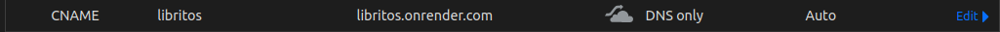

So in my case the website will be available at `https://libritos.jonathan.com.ar`

### Create a turso account and run the script `turso-start.sh`

### Create a render account and add the repository

Create a `web service` and add my repository which is `https://github.com/jd-apprentice/libritos`

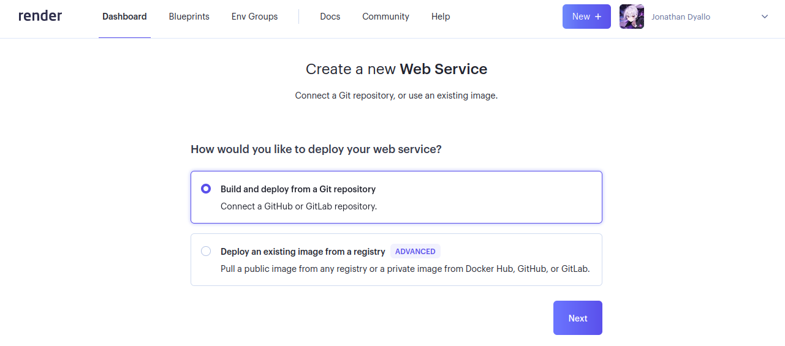

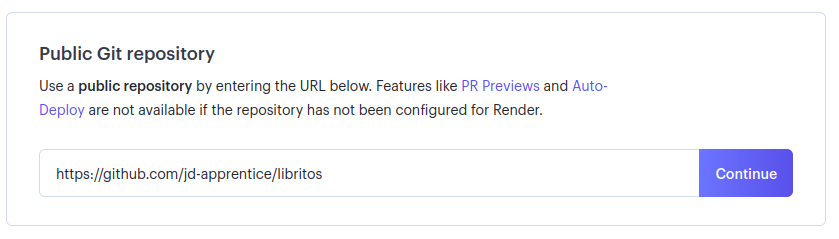

Base configuration would be something like this

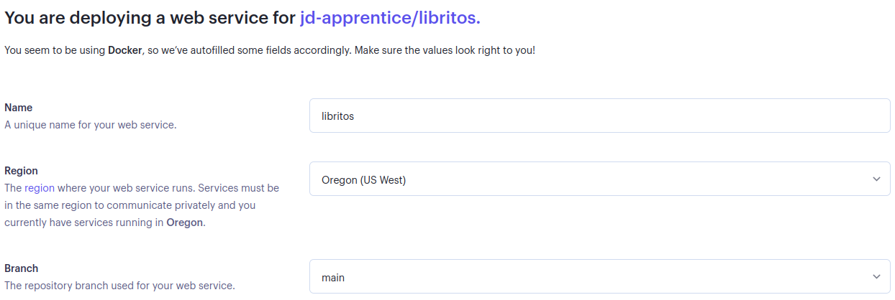

Now for advance configuration is where we add our environment variables

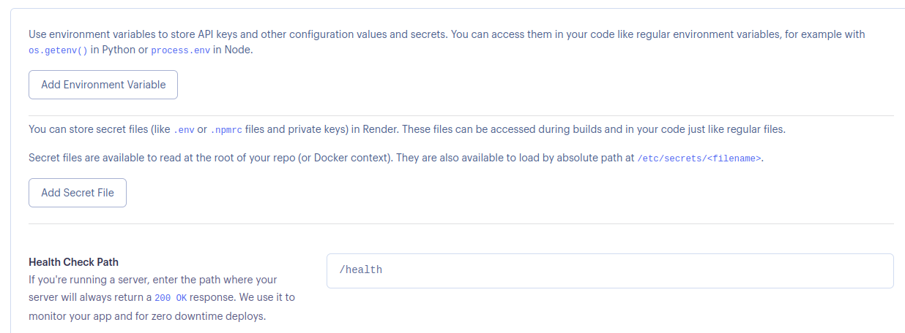

Also remember to add the /health endpoint to the health check

Here is a table with the environment variables

| Name | Value | Example |
| ---- | ----- | ------- |
| DISCORD_TOKEN | Discord bot token from the developer portal | 123456789 |
| DISCORD_CHANNEL_ID | Discord channel id where the bot is allowed to receive files | 123456789 |
| ALLOWED_FORMATS | Allowed formats for the bot to upload | "application/pdf, application/epub+zip, application/x-mobipocket-ebook"
| BOOKS_TABLE | Name of the table where the books are going to be stored | books |
| TURSO_URL | Url of the turso instance | libsql://database-user.turso.io
| TURSO_DB_TOKEN | Token of the turso instance | 123456789

### Create a discord bot and add it to your server

In the discord developer portal create a bot

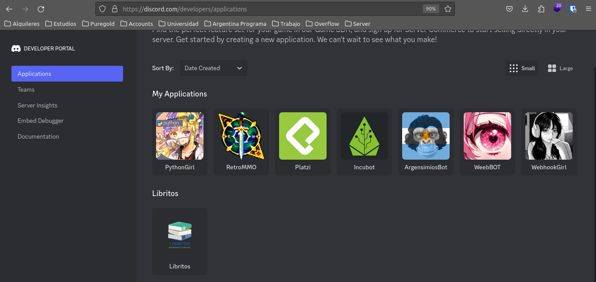

Under the `Bot` section we are going to retrieve the token

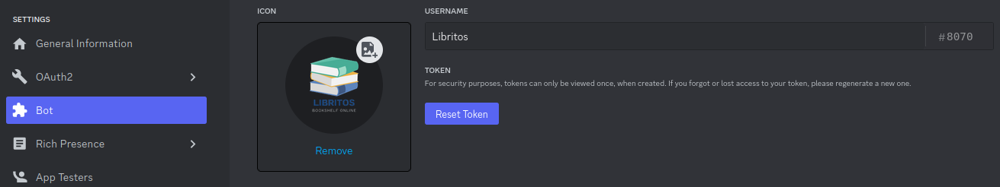

Bot is going to need the following permissions in the `OAuth2` section

- Read Messages/View Channels
- Send Messages
- Read Message History
- Use Slash Commands

Then in the `Bot` section make sure message intents are enabled like this

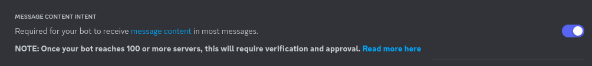

#### Deployment outside of render

Since i've built this application with docker in mind you can deploy it anywhere you want as long as you have docker installed or the service that you are using supports dockerfiles.

In case you are using another service or your own server make sure the use the `"build:others": "lerna run build:others"` from lerna to build the project, since the default build is for render, which in the background i've added a `bun install` to install the dependencies since render doesn't install them by default.

# Usage 📖

## Discord Bot 🤖

How to use the discord bot:

send a message with the following format

```
image: <url>
description: <message>
```

and a file attached to the message

`files must be smaller than 20MB`

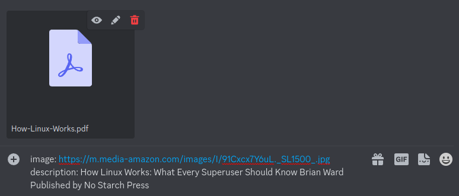

if everything was okay you will see the `file saved` message

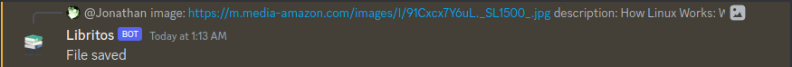

else you will see the proper validation that is stopping the file from being uploaded

## Web Application 🌐

Once the file is uploaded to the server you can see it in the web application

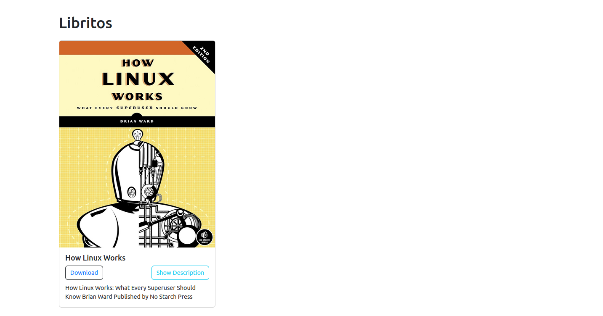

# Contributing 🤝

Contributions, issues and feature requests are welcome!

# License 📝

This project is [GPL-3.0](LICENSE) licensed.

# Contact 📧

Social media links and email address available at my [linktr.ee](https://linktr.ee/jd_apprentice)
